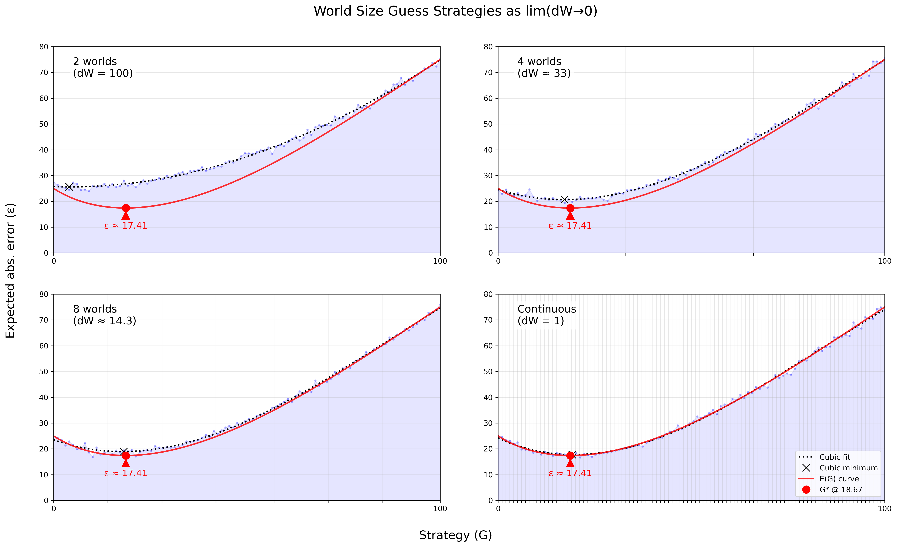

## Gott's Argument

Gott's "$\Delta t$ argument" is simply:
1. Given we're measuring *only* between times $t_{begin}$ and $t_{end}$
2. Barring anything special about $t_{now}$

Then "we expect $t_{now}$ to be located randomly in this interval." This is basically just the principle of mediocrity.

Since $t_{begin}$ and $t_{end}$ could be anything, we'll use $r = (t_{now} - t_{begin})/(t_{end} - t_{begin})$ to normalize our observation of $t_{now}$ to a value between 0 and 1. For such a value, Gott says "...there is a probability $P = 0.95$ that $0.025 < r < 0.975$".
Or, visually:

Possible world $w_1$

On closer inspection, this isn't saying much of anything. Except for the trivial case that we are 100% sure $t_{now}$ belongs to this interval (which is guaranteed by premise 1), every other confidence interval $P < 1$ can be expressed an infinite amount of ways.
For example, we are just as confident that our $t_{now}$ won't belong to the middle 5%:

Possible world $w_2$

The problem is that, in spite of our high confidence in $w_1$, we believe equally ($P = 0.95$) in all worlds whose 5% disbelief fall within $w_1$'s 95%. The distribution is ultimately uniform, and $t_{now}$ could be from anywhere along it. The same confidence interval for $r$ (normalized $t_{now}$) in $w_1$ can be interpreted as a statement about $(t_{end} - t_{now})$—or in other words, the future.
Let $t_{past} = (t_{now} - t_{begin})$⠀and⠀$t_{future} = (t_{end} - t_{now})$,⠀so now⠀$r = \frac{t_{past}}{t_{past} + t_{future}}$. All we've done is started thinking about beginnings and ends as distances from *now* (plus, it's cleaner). 

<table width="100%"><tr>
<td>

For the lower bound (0.025):
$0.025 = \frac{t_{past}}{t_{past} + t_{future}}$, isolate:
⠀⠀⠀⠀⠀⠀⠀⠀⠀⠀⠀⠀⠀$t_{future} = 39t_{past}$

</td>
<td>

For the upper bound (0.975):
$0.975 = \frac{t_{past}}{t_{past} + t_{future}}$, isolate:
⠀⠀⠀⠀⠀⠀⠀⠀⠀⠀⠀⠀⠀$t_{future} = \frac{1}{39}t_{past}$

</td>
</tr></table>

So for $w_1$'s confidence interval, $\frac{1}{39}t_{past} < t_{future} < 39t_{past}$. We'll need such estimates for the Doomsday argument.

---

Using Gott's logic, Bostrom suggests we assume:
$t_{future} = (t_{end} - t_{now}) \approx t_{past} = (t_{now} - t_{begin})$

Or in other words, we *pretend* that the series will continue for roughly as long as it's already lasted. Ignoring any boring wins caught by whatever tolerance we assign to the word "roughly" ($\pm$ 0.01%, 2.5%, etc.), we're almost always wrong and overshoot as often as we undershoot—50/50 odds. It's reasonable to question why being symmetrically wrong would be preferable to any other strategy. Bostrom doesn't appear to offer any stronger reasoning than an appeal to neutrality, and our concerns with Gott's original argument certainly give us no reason to prefer $w_2$.

## My argument

If we instead measure how wrong we are, it becomes very clear that picking the mean is the dominant strategy. If you always pick 5, you'll never be more than 5 off. Whereas fringe strategies like 0 and 10 will be 10 off half as often, but 9 off almost as often, 8 not far behind, etc. Let's run a simulation for strategies $S_0$ to $S_{10}$ and see if this checks out:

Figure 1

Looks correct. Estimated error appears to be quadratic. $\varepsilon$ converges on half its strategy's distance from either end, and worst-case $\varepsilon$ is always half of world size. Worth keeping in mind for the math ahead.

Let's attempt to mathematize—experiment and intuition gets us only so far. Imagine our world $w$ is somewhere along a line from 0 to $W$, your guess $G$ divides this line into two segments. The expected error of these two segments are integrals over $G-w$ and $w-G$, respectively. To find our total expected error function $E_W(G)$, we add them:
$$
E_W(G) = \frac{1}{W} \left( \int_{0}^{G} (G - w) dw + \int_{G}^{W} (w - G) dw \right) = \frac{1}{W} \left( \frac{G^2}{2} + \frac{(W - G)^2}{2} \right)
$$
$$
E_W(G) = \frac{G^2 - W G + \frac{1}{2} W^2}{W}
$$
The numerator is our parabola observed in the simulation above. You can think of the denominator as normalizing over world size, giving us the average expected error per unit length. A precondition is that $G\leq W$, which is satisfied on account of having set $W$ ourselves, ostensibly because we believe larger worlds could not exist.
But let's consider it since it'll be important in a moment. If $G > W$, then $E_W(G) = G - \frac{W}{2}$. It's linear because we've lost the uncertainty of "walking" in the wrong direction; we're just subtracting the mean of the distribution.

Notice our toy example was given a discrete, unambiguous beginning and end [0,10]. This would be the equivalent of knowing our world size, which is not known to anyone but clairvoyants. To begin predicting optimal strategies for the Doomsday argument, we must account for this.

### Assumptions
According to our own rationale, we must reason as if we are a random sample from the interval. A fine statement on its own, but I'm straining credulity if I ask you to reason before you've observed you can reason. No person reading has yet to make an observation. So we must determine how one, from behind a Rawlsian veil of ignorance—a magical place where one can reason without belonging to the human reference class—would bet. So long as you believe there is some world to speak of, you must entertain the idea that you could be "Adam" (i.e. before observing, your world was size 0). Obviously, no negative population can exist, so our lower bound must be 0 even if it's difficult to imagine not observing from within a population. Fixing this term doesn't change much mathematically, so both $W_1$ and $W_2$  will remain free until later.

Lastly, we will assume our true world size $W$ is uniformly distributed between $W_1$ and $W_2$; that is, we believe all possible worlds belonging to this interval are equally possible, which is the best a Bayesian can do without any evidence to the contrary. Although we might consider some worlds more likely than others, we think so given auxiliary evidence and update our prior accordingly. For example, worlds where $W_2$ is only slightly larger than our population now are downregulated by our confidence that the world won't end tomorrow. We also can't consider infinite worlds, since it's not possible to uniformly select from $[0,\infty$). This is because the infinitely many numbers from this distribution must have probabilities $P$ that sum to 1, so $P$ for each must equal 0 (not useful). With knowledge about the universe, we might conclude that humanity is finite anyway, at least because our accessible universe is finite and head death defeats infinite time. 

With these conditions in mind, the overall expected error $E(G)$ should be:

$$
E(G) = \frac{1}{W_2 - W_1} \left( \int_{W_1}^{W_2} E_W(G) \, dW \right)
$$

But this integral is discontinuous! As seen in our toy example, our expected error follows a different function when our $G>W$. Sure, we'll still never bet above our upper bound $W_2$, but all $G$s $> W_1$ risk being larger than their world.

So we evaluate them separately:⠀$E(G) = \dfrac{I_1 + I_2}{W_2 - W_1}$,⠀where...

1. $I_1$ is for worlds where $G \leq W$ (Integrate over $W$ from $W_1$ to $G$):

$$
I_1 = \int_{W_1}^{G} \left( G - \frac{W}{2} \right) dW = \left[ G W - \frac{W^2}{4} \right]_{W_1}^{G}
$$

2. $I_2$ is for worlds where $G > W$ (Integrate over $W$ from $G$ to $W_2$)
$$
I_2 = \int_{G}^{W_2} \left( \frac{G^2 - W G + \frac{1}{2} W^2}{W} \right) dW = G^2 \ln\left( \frac{W_2}{G} \right) - G(W_2 - G) + \frac{1}{4} (W_2^2 - G^2)
$$

After integrating and simplifying, we arrive at:

$$
E(G) = \frac{1}{W_2 - W_1} \left[ \frac{3}{2} G^2 - G(W_1 + W_2) + \frac{1}{4} (W_1^2 + W_2^2) + G^2 \ln\left( \frac{W_2}{G} \right) \right]
$$

To find the optimal (minimum) error guess $G^\star$, we'll need to find when $E(G)$'s derivative = 0:

$$
G^\star = \frac{dE}{dG} = \frac{1}{W_2 - W_1} \left[ 2G (1 + \ln\left( \frac{W_2}{G} \right)) - (W_1 + W_2) \right] = 0
$$

$$
G + G\ln\left( \frac{W_2}{G} \right) = \frac{W_1 + W_2}{2}
$$

The $G$ inside the logarithm makes this impossible to solve algebraically, but we can converge on the solution with an algorithm. Since this convergent value is the system's minimum, future recountings of this equality will use $G^\star$ instead of $G$. The following simulation implements this algorithm and also tries every strategy $S_0$ to $S_{100}$ on an increasing number of possible worlds between $W_1$ = 0 and $W_2$ = 100:

Figure 2

The simulated optimal strategy approaches our theoretical value. Good news! Interestingly, if we update the simulation with a different $W_2$, $G^\star$ will always be some ~18% of that value. We will attempt to show this formally. Recall that it's neither pragmatic nor feasible to entertain an infinite world size $W_2$. but we can investigate how $G^\star$ changes for any number, even large ones.

### Behavior of $G^\star$ as $W_2 \to \infty$

Our equation for $G^\star$⠀was⠀$G^\star \left( 1 + \ln\left( \dfrac{W_2}{G^\star} \right) \right) = \dfrac{W_1 + W_2}{2}$.⠀As $W_2 \to \infty$ and $W_1$ remains finite, a finite $W_1$ becomes so vanishingly small that we may discount it. Though this is overdetermined, since $W_1$ is already expected to be 0. Now we know our analysis should hold, even with not-so-large upper bounds for worlds.

Let's introduce a new variable $x$ to represent this observed ratio between $W_2$ and our best guess $G^\star$ such that $G^\star = x W_2$.

Substituting back into the optimality condition and simplifying,

$$
x W_2 \left( 1 + \ln\left( \frac{W_2}{x W_2} \right) \right) = \frac{W_2}{2}
$$
$$
x \left( 1 - \ln(x) \right) = \frac{1}{2}
$$

Although this equation must be solved iteratively, our estimate for this value from the simulation can cut out a good number of steps. Let's subtract the $1/2$ for a clean target of 0:

When does⠀$x \left( 1 - \ln(x) \right) - \dfrac{1}{2} = 0$ ?

| $x$  | $f(x)$    |
| ---- | --------- |
| 0.18 | $-0.0113$ |
| 0.19 | ⠀ $0.0055$  |

By linear interpolation between $x = 0.18$ and $x = 0.19$:

$$
x \approx 0.18 + \frac{0 - (-0.0113)}{0.0055 - (-0.0113)} \times (0.19 - 0.18) \approx 0.1867
$$

Indeed, the optimal guess $G^\star$ and $W_2$ do scale linearly:

$$
G^\star = x W_2 \approx 0.1867 W_2
$$

No matter how large $W_2$ becomes, guessing $18.67\%$ of $W_2$ is *always* the optimal strategy. This is because the frequency of small observations, which are possible in all worlds, offset the large but rare errors you make incur from guessing small in large worlds.
With respect to the original rule, $t_{future} \approx t_{past}$, we should now act as though the series will continue for roughly $4.356$ times as long as it's already lasted, or $t_{future} \approx 4.356\cdot t_{past}$.

## Criticism & context

A possible criticism of my approach is that it seems to give possible worlds too much say in our estimate for the actual world. We dismissed SIA for a similar reason, so have we done something wrong?

While the model appears to be biased towards smaller worlds, unlike SIA, it doesn't claim any world to be more likely than another. That is, there is no attack from the Presumptuous Philosopher. If we're still concerned, we can reformulate our method to allow for possible worlds to "double dip"—that is, an observation of 7 could belong to a world with $W_2 = 10$ and $W_2 = 100$. It is already clear this is inconsistent with the original Urn thought experiment: if I were to draw a 7 ball, I'm unsure whether it belonged to $W_{10}$ or $W_{100}$, but I *am* certain it belong to only one of them. That is, both urns have their own 7. It's also important that each possible world not share its interval with any other once our beliefs about them become non-uniform. If we believe $W_{100}$ to be much more likely than $W_{10}$, suddenly a 7 from $W_{100}$ $\neq$ the one from $W_{10}$.

Though we may be assured our model fits the Doomsday argument better than $t_{future} \approx t_{past}$, where came our confidence that Doomsday argument best fits our world? If, as with the urns, doom-early and doom-late *must* both be thought of as materially existent worlds from which you could observe, it disagrees with our perception of reality.
Conventionally, there exists one "real" world with definite but presently unknown properties. Revisiting Figure 1, it might appear at first to model this kind of reality. But it requires $W$ be known; we call it $W$ so as not to lose generality. Although we may place an upper bound on $W_2$, its value is truly unknown—my model captures this. It is simply the case that reasoning about our uncertainty in $W_2$ *looks* like a belief in materially real possible worlds. More should be said on this.

#### (In)significance of results?

Under the UN's population growth model, traditional anthropic reasoning gives us 100 years to our ~400. Postponing the apocalypse 3 times over calls for celebration, but this change is not as substantial as techno-optimists might hope. Bostrom estimates that humanity might eventually reach $10^{18}$ to $10^{20}$ stars, which could sustain a total $10^{35}$ biological human beings and vastly more digital ones. Indeed, for the optimist to be satisfied, we would need to be among the first 0.0000000000000000000001% of humans to live in this world!

Say we made it to 2500, believing doom was nigh according to our prophecy from the 21st century. As civilization waits with bated breath for the apocalypse, philosophers reconsult this literature and rejoice, for we actually have another 400 years to go. From this time onward, every year, this model will predict a doomsday in the near future that never draws nearer. This is perhaps the most important caveat; anthropic reasoning is the kind of reasoning we employ with no/little evidence. It is a prior, and nothing more.

If we merely last as long as the typical mammalian species, we still have over 200,000 years to go (Barnosky et al. 2011). Then again, no other earthly species—mammalian or otherwise—has simultaneously explored the power of nuclear fusion for great good and existential harm. Toby Ord accounts for both known and unknowable risk in his odds of “existential catastrophe” in the next century, which he places at 16%: one in six.

Further, though the UN has its estimates for population growth, they do not (and cannot) account for technological black swan events like life extension, whole brain emulation, or AGI. "Humanity" might drag on due to an immortal few who rarely or never reproduce. Exotic observers like augmented humans, digitized minds, or artificial superintelligence may not even belong to the "human" reference class, and thus our evolution into higher forms may be read as our end.
