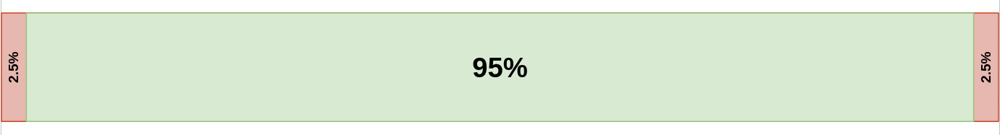
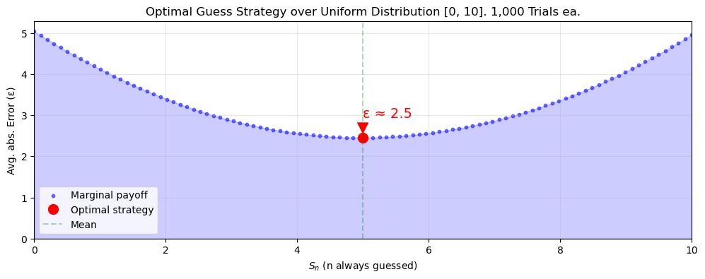
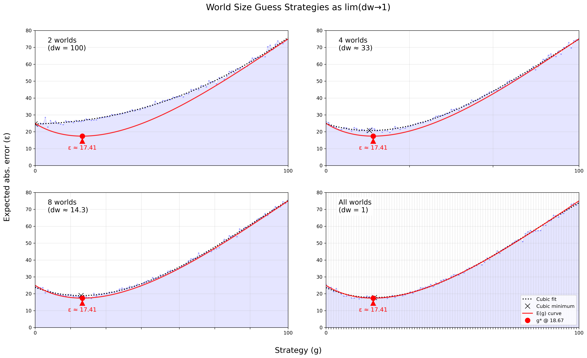
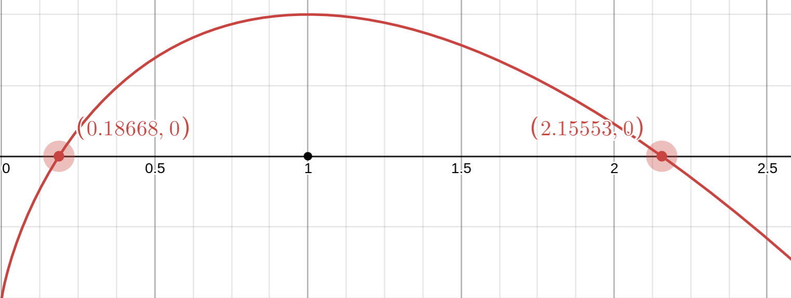

## Gott's Argument

Gott's "$\Delta t$ argument" is simply:
1. Given we're measuring *only* between times $t_{begin}$ and $t_{end}$
2. Barring anything special about $t_{now}$

Then "we expect $t_{now}$ to be located randomly in this interval." This is basically just the principle of mediocrity.

Since $t_{begin}$ and $t_{end}$ could be anything, we'll use $r = (t_{now} - t_{begin})/(t_{end} - t_{begin})$ to normalize our observation of $t_{now}$ to a value between 0 and 1. For such a value, Gott says "...there is a probability $P = 0.95$ that $0.025 < r < 0.975$".
Or, visually:

Possible world $w_1$

On closer inspection, this isn't saying much of anything. Except for the trivial case that we are 100% sure $t_{now}$ belongs to this interval (which is guaranteed by premise 1), every other credible interval $P < 1$ can be expressed an infinite amount of ways.
For example, we are just as confident that our $t_{now}$ won't belong to the middle 5%:

Possible world $w_2$

The problem is that, in spite of our high confidence in $w_1$, we believe equally ($P = 0.95$) in all worlds whose 5% disbelief fall within $w_1$'s 95%. The distribution is ultimately uniform, and $t_{now}$ could be from anywhere along it. The same credible interval for $r$ (normalized $t_{now}$) in $w_1$ can be interpreted as a statement about $(t_{end} - t_{now})$—or in other words, the future.
Let $t_{past} = (t_{now} - t_{begin})$⠀and⠀$t_{future} = (t_{end} - t_{now})$,⠀so now⠀$r = \frac{t_{past}}{t_{past} + t_{future}}$. All we've done is started thinking about beginnings and ends as distances from *now* (plus, it's cleaner). 

<table width="100%"><tr>
<td>

For the lower bound (0.025):
$0.025 = \frac{t_{past}}{t_{past} + t_{future}}$, isolate:
⠀⠀⠀⠀⠀⠀⠀⠀⠀⠀⠀⠀⠀$t_{future} = 39t_{past}$

</td>
<td>

For the upper bound (0.975):
$0.975 = \frac{t_{past}}{t_{past} + t_{future}}$, isolate:
⠀⠀⠀⠀⠀⠀⠀⠀⠀⠀⠀⠀⠀$t_{future} = \frac{1}{39}t_{past}$

</td>
</tr></table>

So for $w_1$'s credible interval, $\frac{1}{39}t_{past} < t_{future} < 39t_{past}$. We'll need such estimates for the Doomsday argument.

---

Using Gott's logic, Bostrom suggests we assume:
$t_{future} = (t_{end} - t_{now}) \approx t_{past} = (t_{now} - t_{begin})$

Or in other words, we *pretend* that the series will continue for roughly as long as it's already lasted. Ignoring any boring wins caught by whatever tolerance we assign to the word "roughly" ($\pm$ 0.01%, 2.5%, etc.), we're almost always wrong and overshoot as often as we undershoot—50/50 odds. It's reasonable to question why being symmetrically wrong would be preferable to any other strategy. Bostrom doesn't appear to offer any stronger reasoning than an appeal to neutrality, and our concerns with Gott's original argument certainly give us no reason to prefer $w_2$.

## An alternative

Let's say I've just picked a number between 0 and 10, inclusive, and I'm asking you to guess what number it is. I don't expect you'll get it right—you're not a mind reader, after all—but I might be impressed if you're off by one. In pursuit of my admiration, you reason that minimizing the amount you might be wrong by is the optimal strategy. If you always bet 5, you'll never be more than 5 off (e.g. if I picked 0 or 10). Whereas if you were to guess 0 or 10, you'll be off by 10 only half as often, but *also* 9 off almost as often, 8 not far behind, and so on. You therefore resolve to always guess that I've picked 5, as it appears to be the optimal strategy.

We've run a simulation for strategies $S_0$ to $S_{10}$. Let's see if this checks out:

{width=80%}

Your bet on $S_5$ pays off. Your average error of 2.5 doesn't leave me too impressed, but you could be much worse off. This is the game of error minimization. Before we can tackle the greater stakes of armageddon, we'll need to make a general and formal case for this kind of strategy. The curve you've doubtless spotted in the toy example appears to be a parabola. ==We'll soon devise a function to model this curve and others, which we'll call **error functions**, and we'll start with the toy example:==

### Modeling one world

Instead of choosing a number randomly, I'll be discovering my birth rank. Imagine my rank number $x$ is somewhere along an interval from 0 to $W$, where $W$ is our known world size (that is, $t_{end}$; person #$W$ is the last human to ever be—never mind that this is unknowable, this is what we take capital $W$ to mean). Your guess $g$ divides this interval into two segments; $x$ could be on either side of $g$. The total error is found by integrating $g-x$ and $x-g$ over their respective segment lengths. The resulting integral, divided by world size $W$, returns the average error for world of size $W$ given any guess $g$. This is the error function $E_W(g)$:

$$
E_W(g\mid 0\leq g\leq W) = \frac{1}{W} \left( \int_{0}^{g} (g - x)dx + \int_{g}^{W} (x - g)dx \right) = \frac{1}{W} \left( \frac{g^2}{2} + \frac{(W - g)^2}{2} \right)
$$

$$
E_W(g\mid 0\leq g\leq W) = \frac{g^2 - W g + \frac{1}{2} W^2}{W}
$$

This function's readability pleasantly surprises. Its numerator is a classic quadratic responsible for the parabola observed previously, and its denominator gives us the average error instead of an aggregate. 
If you were to solve for the function's minimum, you'll rediscover the optimal strategy—call this $g^\star$. Notice, too, the condition we've placed on $g$: it must belong to the interval. Although we *could* guess some $g > W$ or $g < 0$, it would be absurd on account of $W$'s definition and whatever a world smaller than zero means. The real reason for restricting $g$ is because the error function behaves differently beyond this regime:
$$
E_W(g\mid g > W) = g - \frac{W}{2}
$$

For guesses $> W$, the error curve becomes linear since we've lost the uncertainty of "walking" in the wrong direction; we're just subtracting the interval's mean from $g$.  Although guessing "out of bounds" is of no use to us presently, we won't always be so lucky. We have also taken for granted our knowledge of $W$, which only appears as a variable so as to not lose generality. What's more, our possible world interval should be discrete; while I could've picked 3.6 from the continuous interval [0,10], we haven't counted fractions of people since 1868. To begin predicting optimal strategies for the Doomsday argument, we must account for these complexities.

We're allowed to integrate over a continuous interval because we're summing infinitesimals. Not so for a discrete one. Let us instead represent our error function as a sum and solve for its closed form:

$$
E_W(g\mid 0\leq g\leq W) =\sum_{x=0}^{W}|g - x| = \sum_{x=0}^{g}(g - x) + \sum_{x=g+1}^{W}(x - g)
$$

$$\frac{g(g+1)}{2} + \frac{(W-g)(W-g+1)}{2} = \frac{W^2 - 2gW + 2g^2 + W}{2(W+1)}$$

It's very similar. This would simplify to our original without the $+1$ on the $W$ (more on this later).
$$
E_W(g\mid g > W) = \frac{1}{W+1}\sum_{x=0}^{W}(g - x) = \frac{1}{W+1}\left((W+1)g - \frac{W(W+1)}{2}\right) = g - \frac{W}{2}.
$$
And this part is identical. Let's ditch the conditions on $g$ and write the new discrete $E_W$ as a piecewise function:

$$
E_W(g) = 
\begin{cases}
\frac{W^2 - 2gW + 2g^2 + W}{2(W+1)}, & \text{if } g \leq W \\[6pt]
g - \frac{W}{2}, & \text{if } g > W.
\end{cases}
$$

Born out of our toy example, $E_W$ has successfully generalized our reasoning about error to a world of known size $W$. Let's move on to the Doomsday problem.

### Modeling all possible worlds
According to our own account of anthropic reasoning, we must reason as if we're a random sample from the interval. Since we've already observed our place on the interval, it may seem impossible to think in this way. Indeed, I'm willing to bet all of you reading this have observed you exist already. ==Our model will therefore represent the prior belief one *would* have in the size of our world before making any observations== (Bayesians do this all the time). In other words, how one, from behind a Rawlsian veil of ignorance—a magical place where one can reason without belonging to the human reference class—would place their bets. From this place, we will make some a priori assumptions:

1. So long as you believe there is some world to speak of, you must entertain the idea that you could be "Adam" (i.e. before observing, your world was size 0). Obviously, no negative population can exist, so our lower bound must be 0 even if it's difficult to imagine not observing from within a population.

2. We can't consider infinite worlds, since it's not possible to uniformly select from a countably infinite set like whole numbers. All elements must have equal probabilities $P$ that sum to 1, and so $P$ for each must equal 0 (not useful to anyone). If you find this unsatisfying, the universe imposes limits of its own. Our growth is necessarily finite, at least because our accessible universe is finite and entropy defeats infinite time.

3. We believe all possible worlds belonging to this interval are equally possible, which is the best a Bayesian can do without any evidence to the contrary. Although we might consider some worlds more likely than others, we think so given auxiliary evidence and update our prior accordingly. For example, a world only slightly larger than our population now is downregulated by our confidence that the world won't end tomorrow.  

==Our world size, now lowercase $w$ , is unknown==, though we've reasoned it belongs to the set of possible worlds $\{W_1=0, W_1+1, \cdots, W_2 \}$ where $W_2$ is some finite upper bound we can (and will) make estimates for. 

To find the error function for a world of unknown size $w$, we just need to find average error of all possible worlds:

$$
E_{\forall}(g) = \frac{1}{W_2 - W_1} \left( \int_{W_1}^{W_2} E_W(g\mid W=w) \, dw \right)
$$

Parts of this should look familiar. We are integrating our original error function $E_W$ over the interval, and our variable $w$ gets to roleplay as $W$ in each possible world where it is known. Then we divide by the interval size to get our average (a.k.a. expected) error function. Evaluating $E_W$'s discontinuity:

$$
E_{\forall}(g) = \frac{1}{W_2 - W_1}\left(\int_{W_1}^{g}\left(g - \frac{w}{2}\right) dw \;+\; \int_{g}^{W_2}\frac{g^2 - wg + \tfrac{1}{2} w^2}{w} dw\right).
$$

This implies some guesses are being made over the value of $w$. If it is unclear why, imagine instead that you're playing a game of darts blindfolded. The dartboard's size $w$ can vary randomly between a maximum and minimum size $W_2$ and $W_1$. You won't know the size of the board when you throw, but you do know that its leftmost edge is fixed at an origin (0), and so the center will be some $w/2$ away from that. You're trying to determine how many paces right should you step to minimize your distance to this bullseye. By moving any distance farther than the smallest possible dartboard diameter, you run the risk of overshooting entirely ($g>w$). This, in fact, is an functionally identical problem.

Recall, however, that our interval of possible worlds is discrete; we must use a sum:

$$
E_{\forall}(g) = \frac{1}{W_2 - W_1 + 1} \sum_{w=W_1}^{W_2} E_W(g\mid W=w)
$$
Thus:

$$
E_{\forall}(g) = \frac{1}{W_2 - W_1 + 1}\left(\sum_{w=W_1}^{g-1}\left(g - \frac{w}{2}\right) \;+\; \sum_{w=g}^{W_2} \frac{w^2 - 2gw + 2g^2 + w}{2(w+1)}\right).
$$

This is going to be obnoxious. Although the discrete model is exact, its far too unwieldy for closed-form analysis. Fortunately, for large $W_2$, the discrete uniform distribution over $\{W_1, \ldots, W_2\}$ closely approximates a continuous uniform distribution on $W_1, W_2$. The sums can therefore return to integrals with negligible precision impact.

1. The first integral is for worlds where $g > w$:
$$
\sum_{w=W_1}^{g-1} \left(g - \frac{w}{2}\right) \approx \int_{W_1}^{g} \left( g - \frac{w}{2} \right) dw = \left[ g w - \frac{w^2}{4} \right]_{W_1}^{g}
$$

This is the total error from possible dartboards a guess $g$ would overshoot
(possible board's diameter is shorter than how far you moved; integrate over $w$ from $W_1$ to $g$).

1. The second is for worlds where $g \leq w$:
$$
\sum_{w=g}^{W_2}\frac{w^2 - 2gw + 2g^2 + w}{2(w+1)} \approx \sum_{w=g}^{W_2}\frac{g^2 - wg + \tfrac{1}{2} w^2}{w} \approx \int_{g}^{W_2} \left( \frac{g^2 - w g + \frac{1}{2} w^2}{w} \right) dw
$$

$$
= g^2 \ln\left( \frac{W_2}{g} \right) - g(W_2 - g) + \frac{1}{4} (W_2^2 - g^2)
$$

This is the total error from possible dartboards a guess $g$ would hit.
Integrate over $w$ from $g$ to $W_2$.

After integrating and simplifying, we arrive at:

$$
E_{\forall}(g) = \frac{1}{W_2 - W_1} \left[ \frac{3}{2} g^2 - g(W_1 + W_2) + \frac{1}{4} (W_1^2 + W_2^2) + g^2 \ln\left( \frac{W_2}{g} \right) \right]
$$

This is the error function for a world size $w$ that is unknown. To find the optimal (minimum) error guess $g^\star = {\text{argmin}_g} E_{\forall}(g)$, we'll need to find the critical points along $E_{\forall}$'s derivative where the slope is positive:

$$
\frac{dE}{dg} = \frac{1}{W_2 - W_1} \left[ 2g (1 + \ln\left( \frac{W_2}{g} \right)) - (W_1 + W_2) \right]
$$
Simplify and set equal to zero to identify critical points:
$$
g\left(1 + \ln\left( \frac{W_2}{g} \right)\right) - \frac{W_1 + W_2}{2}= 0 
$$

So⠀$g^\star = \underset{g}{\text{argmin }} E_{\forall}(g)$⠀where ⠀$
g\left(1 + \ln\left( \dfrac{W_2}{g} \right)\right) - \dfrac{W_1 + W_2}{2}= 0 
$⠀ and $\dfrac{d^2E}{dg^2} > 0$ (positive)

The $g$ inside the logarithm requires us to converge on the solution algorithmically. The following simulation implements our model, finds a minimum, and also tries every strategy $S_0$ to $S_{100}$ on an increasing number of possible worlds between $W_1$ = 0 and $W_2$ = 100:

As we consider more worlds, the expected error for each strategy produces a curve that agrees with our model. Simulating $dw$ = 1 (a.k.a. considering all worlds $\{0, 1, \cdots, 100\}$) fits the model perfectly despite our sneaky use of an integral ($dw \rarr 0$). Interestingly, when I update the simulation with a different $W_2$, $g^\star$ always appears to be some fixed proportion away. Exploring this also presents an opportunity to prove there exists a minimum for any and all interval lengths.

### Behavior of $\mathbf{g^\star}$ as $\mathbf{W_2 \to \infty}$

As $W_2 \to \infty$ and $W_1$ remains finite, a finite $W_1$ becomes so vanishingly small that we may discount it (though this is overdetermined, since $W_1$ is already expected to be 0). $E_{\forall}$'s derivative is therefore: 
$$g^0 \left( 1 + \ln\left( \dfrac{W_2}{g^0} \right) \right) - \dfrac{W_2}{2} = 0$$

The guesses $g$ for which this equality is true are the critical points (all maxima and minima) and are therefore labeled $g^0$ as candidates for $g^\star$.
Let's introduce a new variable $\alpha$ to represent this observed ratio between $W_2$ and our optimal guess $g^\star$. We don't know $g^\star$ just yet, but we do know that it will be one of our candidates $g^0$.

So $g^* = \alpha W_2$. Or plainly, "$g^\star$ is some fraction of $W_2$". 

Substituting this into $E_{\forall}$'s derivative and simplifying,

$$
\frac{dE}{dg} = \alpha W_2 \left( 1 + \ln\left( \frac{W_2}{\alpha W_2} \right) \right) - \frac{W_2}{2}
$$
$$
\alpha \left( 1 - \ln(\alpha) \right) - \frac{1}{2}
$$

This is basically the derivative independent of $W_2$ or $g$:
{width=65%}

To make sense of this, recall what $\alpha$ means: if $\alpha=1$, then $g^\star = W_2$. So solutions suggesting a guess larger than our world size needn't be taken seriously. It just so happens that the second solution is a maximum (negative slope), so $\alpha \approx 0.1867$ is our only minimum anyway. Here's the takeaway:

$$
g^\star = \alpha W_2 \approx 0.1867 W_2
$$

And if we substitute this general solution for $g^\star$ back into $E_{\forall}$:

$$
E_{\forall}(g^\star) = \frac{1}{W_2 - W_1} \left[ \frac{3}{2} (\alpha W_2)^2 - \alpha W_2 (W_1 + W_2) + \frac{1}{4} (W_1^2 + W_2^2) + (\alpha W_2)^2 \ln\left( \frac{W_2}{\alpha W_2} \right) \right]
$$

$$
E_{\forall}(g^\star) \approx \left( \frac{3}{2} \alpha^2 - \alpha + \frac{1}{4} - \alpha^2 \ln(\alpha) \right) W_2 
$$

$$
\approx 0.1741W_2
$$

Behind the Rawlsian veil of ignorance, you should *always* bet $\mathbf{18.67\%}$ of ${W_2}$ and expect to be off by $\mathbf{17.41\%}$ of ${W_2}$. This is because the frequency of small observations, which can happen in all worlds, offset the large but rare errors you incur from guessing small in large worlds. In the dartboard analogy, if you were to superimpose all possible dartboards atop each other (aligned by their leftmost edge as the setup describes), you'd similarly notice that there's more overlap in area nearing the origin. Contrary to Gott and Bostrom's prescription $t_{future} \approx t_{past}$, ==we should act as though the series will continue for roughly $\mathbf{4.356}$ times as long as it's already lasted==, or $t_{future} \approx 4.356\cdot t_{past}$; this is the most correct prior to have.

## Criticisms

### A fault in approach?
A possible criticism of my approach is that it seems to give possible worlds too much say in our estimate for the actual world. We dismissed SIA for a similar reason, so have we done something wrong?

While the model appears to be biased towards smaller worlds, unlike SIA, it doesn't claim any world to be more likely than another. That is, there is no attack from the Presumptuous Philosopher. If we're still concerned, we can reformulate our method to allow for possible worlds to "double dip"—that is, an observation of 7 could belong to a world with $W_2 = 10$ and $W_2 = 100$. It is already clear this is inconsistent with the original Urn thought experiment: if I were to draw a 7 ball, I'm unsure whether it belonged to $W_{10}$ or $W_{100}$, but I *am* certain it belong to only one of them. That is, both urns have their own 7. It's also important that each possible world not share its interval with any other once our beliefs about them become non-uniform. If we believe $W_{100}$ to be much more likely than $W_{10}$, suddenly a 7 from $W_{100}$ $\neq$ the one from $W_{10}$.

Though we may be assured our model fits the Doomsday argument better than $t_{future} \approx t_{past}$, where came our confidence that Doomsday argument best fits our world? If, as with the urns, doom-early and doom-late *must* both be thought of as materially existent worlds from which you could observe, it disagrees with our perception of reality. Conventionally, there exists one "real" world with presently unknown yet definite properties. A single-world model, like our $E_W$ with its fixed $W$, fails to describe this. Making $w$ variable is the only way to reason mathematically about our uncertainty in reality. It is simply the case this presents as a false belief in materially real possible worlds.

### (In)significance of results?

$i.$⠀Doomsday only delayed
Under the UN's population growth model, traditional anthropic reasoning gives us 100 years to our ~400. Postponing the apocalypse 3 times over calls for celebration, but this change is not as substantial as techno-optimists might hope. Bostrom estimates that humanity might eventually reach $10^{18}$ to $10^{20}$ stars, which could sustain a total $10^{35}$ biological human beings and vastly more digital ones. Indeed, for the optimist to be satisfied, we would need to be among the first 0.0000000000000000000001% of humans to live!

$ii.$⠀Not much better with evidence
If we merely last as long as the typical mammalian species, we still have over 200,000 years to go (Barnosky et al. 2011). Then again, no other earthly species—mammalian or otherwise—has simultaneously explored the power of nuclear fusion for great good and existential harm. As you can imagine, there is little certainty about the future even once we account for evidence. Toby Ord accounts for both known and unknowable risk in his odds of “existential catastrophe” this century, which he places at 16%: one in six. And though the UN has its estimates for population growth, they do not (and cannot) account for technological black swan events like AGI, whole brain emulation, or life extension. "Humanity" might drag on due to an immortal few who rarely or never reproduce. Exotic observers like augmented humans, digitized minds, or artificial superintelligence may not even belong to the "human" reference class, and thus our evolution into higher forms may be read as our end.

$iii.$⠀Reasoning without evidence
Say we made it to 2500, believing doom was nigh according to our prophecy from the 21st century. As civilization waits with bated breath for the apocalypse, philosophers reconsult this literature and rejoice, for we actually have another 400 years to go. From this time onward, every year, this model will predict a doomsday in the near future that never draws nearer. This is perhaps the most important caveat; anthropic reasoning is the kind of reasoning we employ with no/little evidence.
