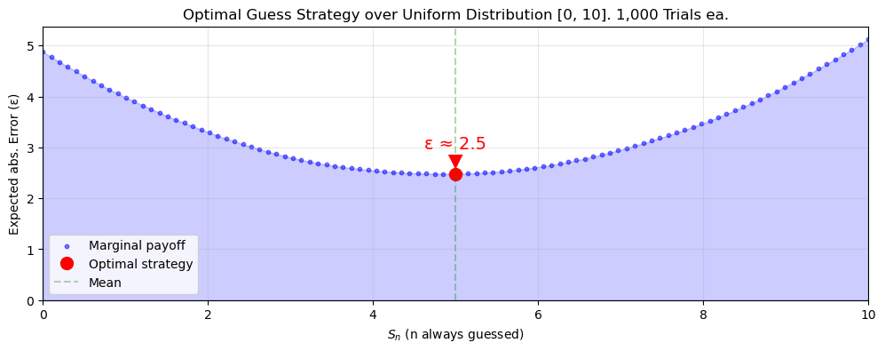

## Gott's Argument

Gott's "$\Delta t$ argument" is simply:
1. Given we're measuring *only* between times $t_{begin}$ and $t_{end}$
2. Barring anything special about $t_{now}$

Then "we expect $t_{now}$ to be located randomly in this interval." This is basically just the principle of mediocrity.

Since $t_{begin}$ and $t_{end}$ could be anything, we'll use $r = (t_{now} - t_{begin})/(t_{end} - t_{begin})$ to normalize our observation of $t_{now}$ to a value between 0 and 1. For such a value, Gott says "...there is a probability $P = 0.95$ that $0.025 < r < 0.975$".
Or, visually:

Possible world $w_1$

On closer inspection, Gott hasn't really discovered anything. Except for the trivial case that we are 100% sure $t_{now}$ belongs to this interval (which is guaranteed by premise 1), every other confidence interval $P < 1$ can be expressed an infinite amount of ways.
For example, we are just as confident that our $t_{now}$ won't belong to the middle 5%:

Possible world $w_2$

The problem is that, in spite of our high confidence in $w_1$, we believe equally ($P = 0.95$) in all worlds whose 5% disbelief fall within $w_1$'s 95%. The distribution is ultimately uniform, and $t_{now}$ could be from anywhere along it. The same confidence interval for $r$ (normalized $t_{now}$) in $w_1$ can be interpreted as a statement about $(t_{end} - t_{now})$—or in other words, the future.
Let $t_{past} = (t_{now} - t_{begin})$⠀and⠀$t_{future} = (t_{end} - t_{now})$,⠀so now⠀$r = \frac{t_{past}}{t_{past} + t_{future}}$. All we've done is started thinking about beginnings and ends as distances from *now* (plus, it's cleaner). 

<table width="100%"><tr>
<td>

For the lower bound (0.025):
$0.025 = \frac{t_{past}}{t_{past} + t_{future}}$, isolate:
⠀⠀⠀⠀⠀⠀⠀⠀⠀⠀⠀⠀⠀$t_{future} = 39t_{past}$

</td>
<td>

For the upper bound (0.975):
$0.975 = \frac{t_{past}}{t_{past} + t_{future}}$, isolate:
⠀⠀⠀⠀⠀⠀⠀⠀⠀⠀⠀⠀⠀$t_{future} = \frac{1}{39}t_{past}$

</td>
</tr></table>

So for $w_1$'s confidence interval, $\frac{1}{39}t_{past} < t_{future} < 39t_{past}$. We'll need such estimates for the Doomsday argument.

---

Using Gott's logic, Bostrom suggests we assume:
 $t_{future} = (t_{end} - t_{now}) \approx t_{past} = (t_{now} - t_{begin})$

Or in other words, we *pretend* that the series will continue for roughly as long as it's already lasted. Ignoring any boring wins caught by whatever tolerance we assign to the word "roughly" ($\pm$ 0.01%, 2.5%, etc.), we're almost always wrong and overshoot as often as we undershoot—50/50 odds. It's reasonable to question why being symmetrically wrong would be preferable to any other strategy. Bostrom doesn't appear to offer any stronger reasoning than an appeal to neutrality, and our concerns with Gott's original argument certainly give us no reason to prefer $w_2$.

## My argument

If we instead measure how wrong we are, it becomes very clear that picking the mean is the dominant strategy. If you always pick 5, you'll never be more than 5 off. Whereas fringe strategies like 0 and 10 will be 10 off half as often, but 9 off almost as often, 8 not far behind, etc. Let's run a simulation for strategies $S_0$ to $S_{10}$ and see if this checks out:

