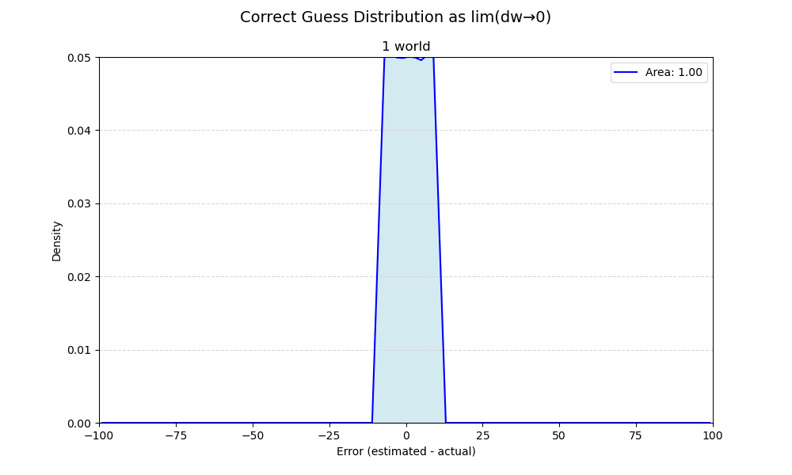

For single worlds—or in other words, when $t_{end}$ is fixed—the distribution of guess error is flat (uniform) and ends at $\pm$ world size.

If there's only one possible world, then guessing your sample is average is no better than guessing randomly. Of course, if you actually *knew* your world size then you'd know the true average, but we're committed to this strategy.

This is basically an integral. As the limit of possible world sizes ($dw$) approaches 0, the union of their areas approximates a distribution of the strategy's effectiveness over all possible worlds.

The peak density seen in $w_1$ strictly diminishes as it appears less frequently among a growing number of possible worlds.

The flat top of $w_1$=10 survives since no worlds <10 are possible.
