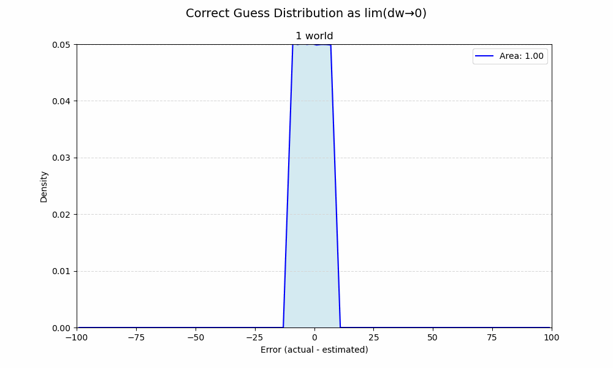
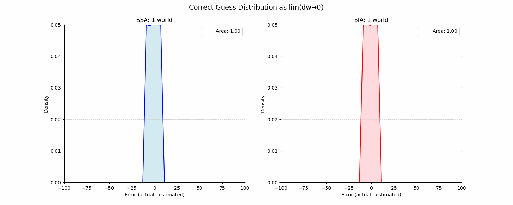

### Gott's "$\Delta t$ argument"
For single worlds—or in other words, when $t_{end}$ is fixed—the distribution of guess error is flat (uniform) and ends at $\pm$ world size.

If there's only one possible world, then guessing your sample is average is no better than guessing randomly. Of course, if you actually *knew* your world size then you'd know the true average, but we're committed to this strategy.

## Doomsday urn
The urn problem commonly presents two urns (worlds) containing 10 and 100 balls, respectively. This is a simplification since we need only compare two specific hypothesis representing "doom soon" and "doom late." 

Gott's $\Delta t$ in action, a.k.a. just SSA:

This is basically an integral. As the limit of possible world sizes ($dw$) approaches 0, their areas approximate a distribution of the strategy's effectiveness over all possible worlds.

The peak density seen in $w_1$ strictly diminishes as it appears less frequently among a growing number of possible worlds.

The flat top of $w_1$=10 survives since no worlds <10 are possible.

Comparing SSA to SIA, where larger worlds are sampled proportional to their size:

SSA is a Laplace distribution whereas SIA is triangular; weighting by world size "undoes" the former's exponentially. Still unmistakably favorable to guess you are average, though you'll be right less often.
