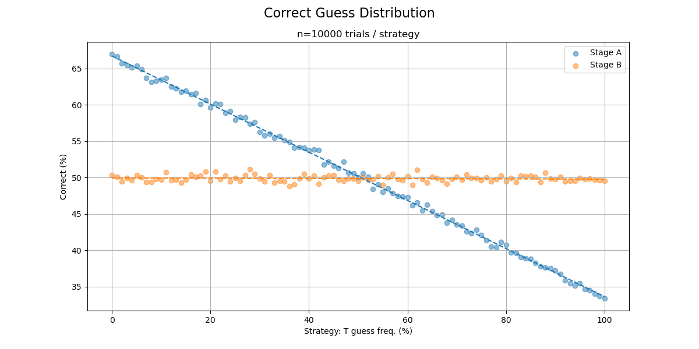

## Incubator
Let's brute-force the incubator problem by evaluating all possible strategies over many trials. We (might?) replicate the results of SSA (+ SIA) without any need for posteriors or selection effects—with the added benefit of being exhaustive 🤞

### Rationale
Imagine $P(E)$ = 0.9. We set our $Cr(E)$ = $P(E)$ according to the Principal Principle

It is suboptimal to randomly choose $E$ 90% of the time; if we guess $E$ 9 times out of 10 and $\neg E$ 1 time in 10, we'll be correct when...
   - $E$ happens, and we guess $E$: 0.9 * 0.9 = 0.81 (81% of the time)
   - $\neg E$ happens, and we guess $\neg E$: 0.1 * 0.1 = 0.01 (1% of the time)

That's 82%. If you instead always guess what is most likely ($P(E)$ > 0.5, therefore $E$), you will only be wrong when $\neg E$. Your winrate will approximate $P(E)$ = 90%, which = $Cr(E)$

For this reason, we need only evaluate strategies at 1 and 0—or really just one, since they're complementary. Guess frequency and success rate are linearly proportional, so frequencies between can be found by interpolating.

To demonstrate this visually, we'll instead do this exhaustively ($E$ has previously stood in for $T$):

$P(T)$ and thereby $Cr(T)$ are found to be $\frac{1}{3}$ in stage $A$ and $\frac{1}{2}$ in $B$. SSA + SIA agrees...
